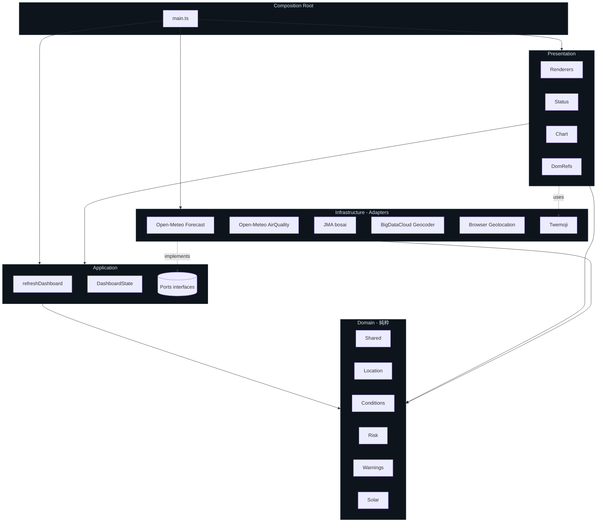

# Architecture

Hexagonal Architecture (Ports & Adapters) を素直に TypeScript / 関数型寄りで実装する。
ドメインを純粋関数とイミュータブル VO の集合として隔離し、外部世界はすべて adapter にカプセル化する。

## 1. レイヤと依存方向



## 2. 依存ルール

| 層 | 依存できる先 | 禁止 |
|---|---|---|
| `domain/` | 自分自身のみ | `fetch`, DOM, Web API, 他 layer 全部 |
| `application/` | `domain/` のみ | infrastructure 実装、DOM、`fetch` を直接呼ぶこと |
| `infrastructure/` | `domain/`, `application/ports.ts` | `presentation/`, `main.ts` |
| `presentation/` | `domain/`, `application/` 型 | `infrastructure/` (例外: `twemoji.ts` のみ) |
| `main.ts` (Composition Root) | 全層 | — |

ドメインは Node でそのまま走る (DOM/`window`/`fetch` を一切参照しない) ため、テストもブラウザ環境不要。

## 3. ディレクトリと責務

```
src/
├── domain/                純粋なドメイン層 (テスト 50+)
│   ├── shared/            汎用VO・Result・Brand・RiskLevel・temporal
│   ├── location/          Coordinate, Location, Prefecture
│   ├── conditions/        WeatherSnapshot, Conditions, weather-code
│   ├── risk/              Metric, Assessment, ドメインサービス + metrics/*
│   ├── warnings/          Severity, ActiveWarning, WarningSet, OfficeCode
│   └── solar/             SolarCycle
│
├── application/           ユースケース層
│   ├── ports.ts           PositionProvider / ForecastProvider 等の interface
│   ├── refresh-dashboard.ts   全panelを更新する唯一のユースケース
│   ├── refresh-dashboard.test.ts (in-memory mock を流す統合テスト)
│   └── dashboard-state.ts init|loading|ready|error の判別共用体
│
├── infrastructure/        外部世界のアダプタ
│   ├── open-meteo-forecast.ts
│   ├── open-meteo-air-quality.ts
│   ├── jma-warnings.ts
│   ├── bigdatacloud-geocoder.ts
│   ├── browser-geolocation.ts
│   └── twemoji.ts
│
├── presentation/          DOM 描画
│   ├── renderers.ts       各panel の renderXxx 関数
│   ├── dom-refs.ts        getElementById をまとめて型付け
│   ├── status.ts          ヘッダのステータス行 + Clock
│   ├── chart.ts           気圧 SVG チャート
│   ├── format.ts          escapeHtml / pad / formatHm 等の純粋ヘルパ
│   └── level-classes.ts   RiskLevel → Tailwind class の対応表
│
├── main.ts                Composition Root: ports → adapters の組み立てのみ
└── style.css              Tailwind v4 の @theme + 最小限の base
```

## 4. ポートと実装の対応

| Port (interface) | 実装 (adapter) | 役割 |
|---|---|---|
| `PositionProvider` | `BrowserGeolocationProvider` | ブラウザ Geolocation API。失敗時は東京フォールバック |
| `WeatherForecastProvider` | `OpenMeteoForecastProvider` | 気象 (気圧, 温湿度, 天気, 降水, UV) |
| `AirQualityProvider` | `OpenMeteoAirQualityProvider` | 大気質 (PM, dust, pollen) |
| `WarningsProvider` | `JmaWarningsProvider` | 気象庁 bosai 警報・注意報 |
| `Geocoder` | `BigDataCloudGeocoder` | 緯度経度 → 都道府県名 |

すべての port は `fetch` を引数で差し替え可能。ユースケーステストでは in-memory 実装に置換する。

## 5. アンチコラプションレイヤ

各 infrastructure adapter は外部 API のスキーマを内部の VO に **必ずマッピングしてから** 返す。
ドメインに `pressure_msl` のような外部命名や、未検証 number が漏れることはない。

```ts
// 例: open-meteo-forecast.ts
const toSnapshot = (raw: Raw): WeatherSnapshot => ({
  hourly: {
    pressure: raw.hourly.pressure_msl.map(Hpa.unsafe),  // Brand化
    temperature: raw.hourly.temperature_2m.map(Celsius.unsafe),
    ...
  },
  ...
});
```

## 6. アーキテクチャ規約の機械的検証

層境界の依存ルールは [`dependency-cruiser`](../.dependency-cruiser.cjs) で **CI で必須化** している。違反コードを書いた瞬間にビルドが落ちる。

```sh
npm run lint:arch          # 依存規約チェック
npm run lint:arch:graph    # 依存グラフ SVG を docs/ に生成 (要 graphviz)
```

主な禁止ルール (`severity: error`):

| ルール | 内容 |
|---|---|
| `domain-must-stay-pure` | `domain/` から `application/` `infrastructure/` `presentation/` `main.ts` への参照禁止 |
| `application-no-infra-or-presentation` | `application/` から `infrastructure/` `presentation/` への参照禁止 |
| `infrastructure-no-presentation` | `infrastructure/` から `presentation/` への参照禁止 |
| `presentation-no-infrastructure` | `presentation/` から `infrastructure/` への参照禁止 |
| `no-circular` | 循環依存禁止 |

`type` インポートも `tsPreCompilationDeps: true` で追跡対象 (型だけの依存も層境界違反になる)。

## 7. なぜこの構造か

- **ドメインがテスト容易**: pure function の集合なので Vitest が node 環境で 1秒以内に 60+ テストを実行
- **API 差し替えが安全**: Open-Meteo を別の気象 API に変えても変更は infrastructure 内に閉じる
- **UI がドメインを汚さない**: presentation 層を Vue/React に書き換えてもドメイン無傷
- **状態が型で網羅される**: `DashboardState` の判別共用体に `switch` で網羅性チェックが効く
