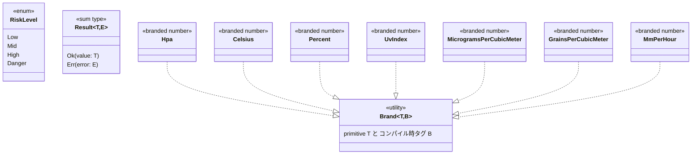
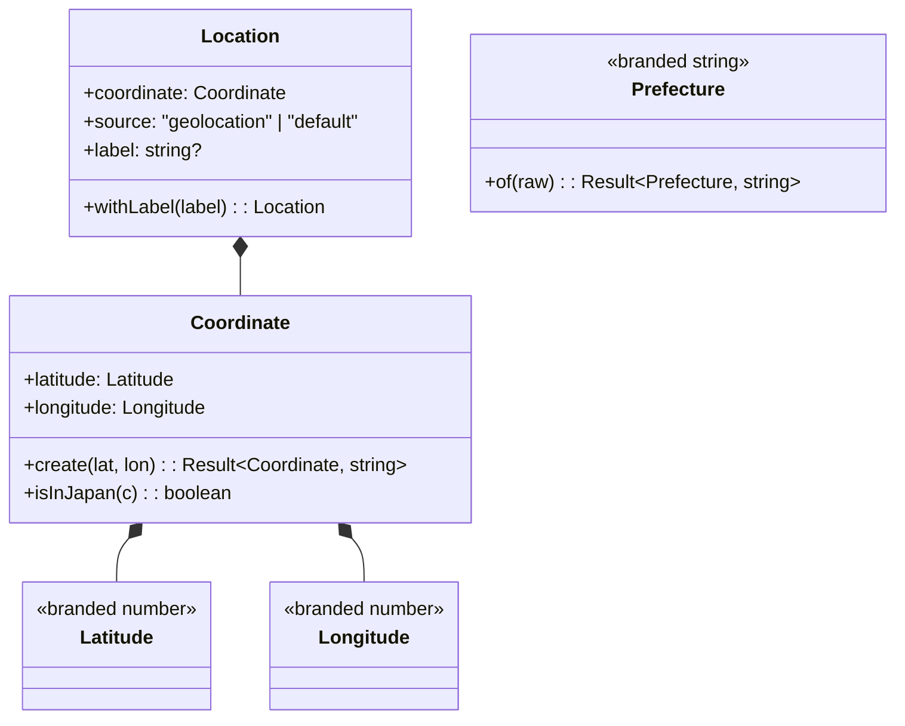
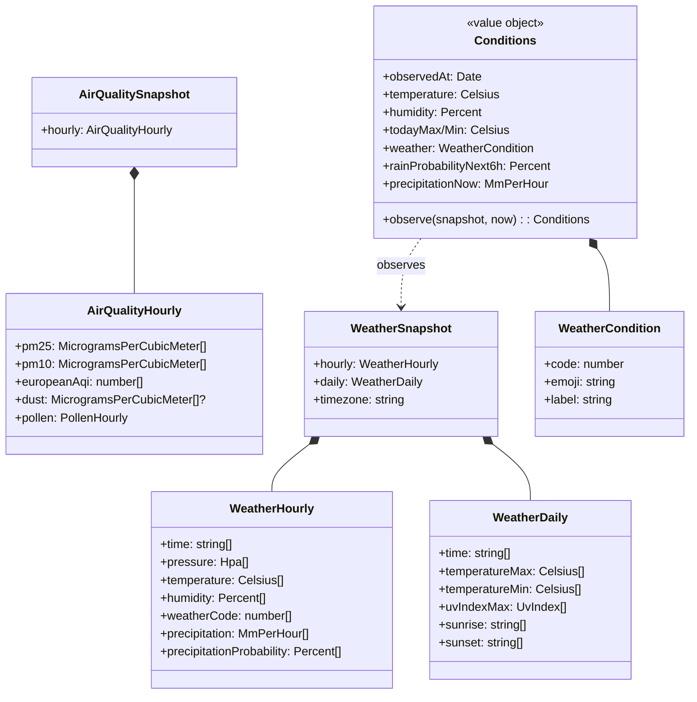
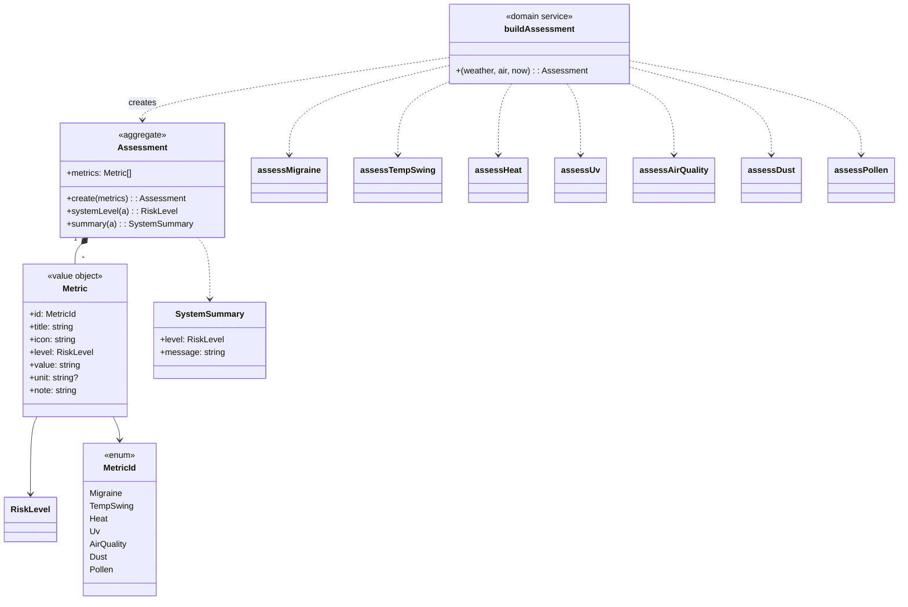
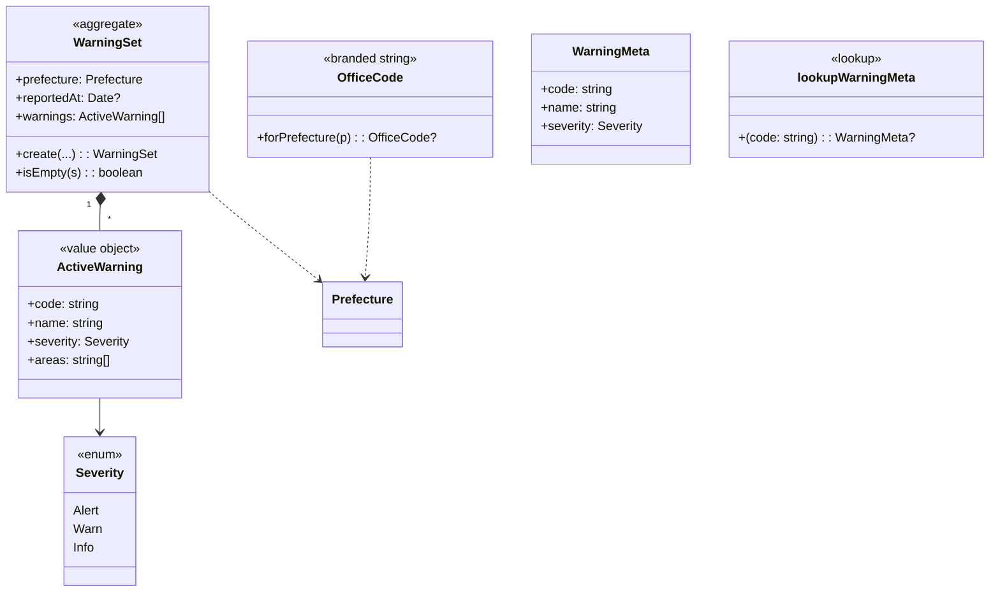
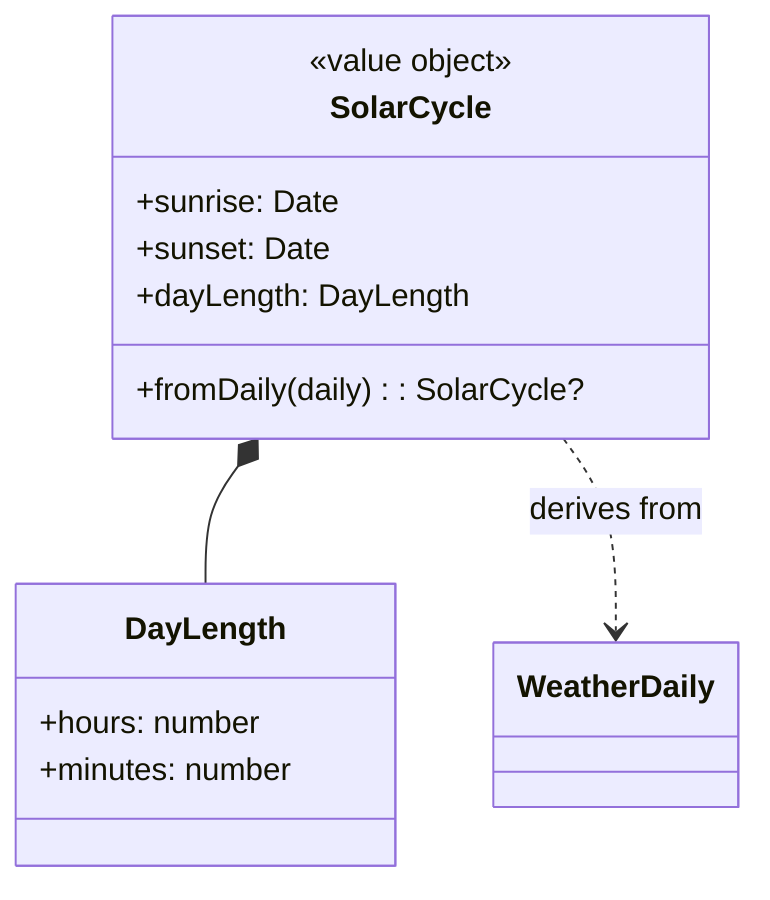

# Domain Model

各 Bounded Context の主要な集約・値オブジェクト・ドメインサービスをクラス図で示す。

## 1. Shared Kernel

ドメイン全体で再利用される基本要素。

## 2. Location Context

## 3. Conditions Context

## 4. Risk Context

各 `assess*` 関数は内部で `observe*` (純粋な観測量計算) と「閾値→RiskLevel 判定」に分かれる。

## 5. Warnings Context

## 6. Solar Context

## 7. 値オブジェクトの不変条件

| VO | 不変条件 |
|---|---|
| `Coordinate` | -90 ≤ lat ≤ 90, -180 ≤ lon ≤ 180 |
| `Hpa` | 800 ≤ x ≤ 1100 |
| `Celsius` | -90 ≤ x ≤ 70 |
| `Percent` | 0 ≤ x ≤ 100 |
| `UvIndex` | 0 ≤ x ≤ 20 |
| `MicrogramsPerCubicMeter` / `GrainsPerCubicMeter` / `MmPerHour` | x ≥ 0 |
| `Prefecture` | 末尾「都/道/府/県」付きの非空文字列 |
| `WarningSet` | warnings は severity 順でソート (alert → warn → info) |
| `Assessment` | metrics 配列は適用可能なものだけが含まれる (黄砂/花粉はデータなしなら省略) |
