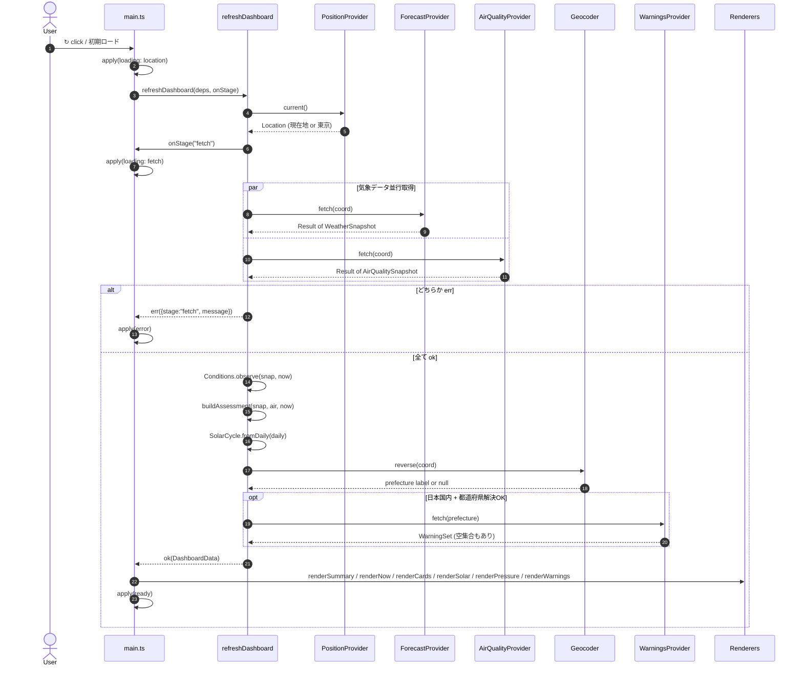
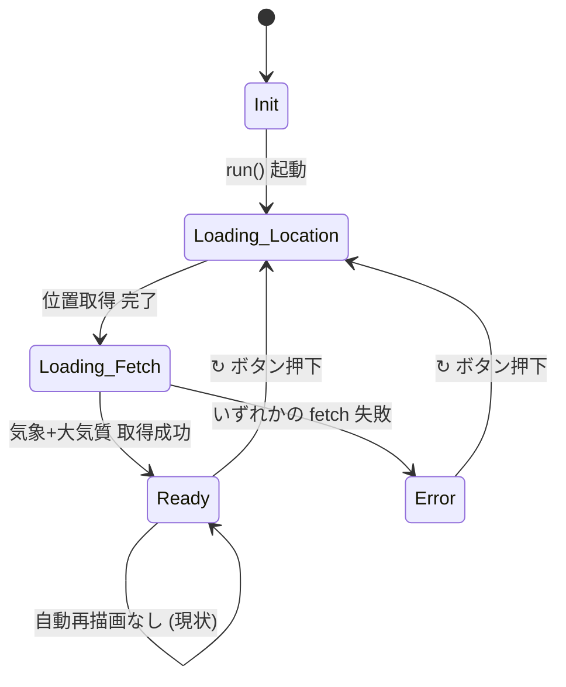

# Use Cases

このアプリのユースケースは「ダッシュボードを最新化する」一つだけ。
入力 = (現在時刻, 注入された Ports)、出力 = `DashboardData` または `RefreshError`。

## 1. シーケンス: refreshDashboard



主な不変条件:
- POS は **必ず** `Location` を返す (Geolocation 失敗は東京フォールバック)
- 逆ジオの失敗は致命的ではなく、警報セクションが出ないだけ
- 大気質が落ちても天気だけで進む — 現状は両方必要 (将来分岐可能)

## 2. 状態遷移: DashboardState



各状態で表示される UI:

| 状態 | スケルトン | カード | ステータス行 | リフレッシュボタン |
|---|---|---|---|---|
| `init` | — | — | INIT | active |
| `loading.location` | 5枚表示 | — | LOC/REQ | spin |
| `loading.fetch` | 維持 | — | FETCH | spin |
| `ready` | hide | 全 panel 表示 | READY | active |
| `error` | hide | 維持 (エラーメッセージのみ) | ERROR ... | active |

## 3. 例: テストでの差し替え方

```ts
import { refreshDashboard } from "./application/refresh-dashboard.js";
import { ok } from "./domain/shared/result.js";

const r = await refreshDashboard({
  position: { current: async () => mockTokyoLocation },
  geocoder: { reverse: async () => "東京都" },
  forecast: { fetch: async () => ok(dummyWeather) },
  airQuality: { fetch: async () => ok(dummyAir) },
  warnings: { fetch: async () => ok(emptyWarningSet) },
  clock: () => new Date("2026-04-23T12:00:00+09:00"),
});
```

ブラウザ・ネットワーク・実時間 すべてが port になっているので決定論的に検証できる。
